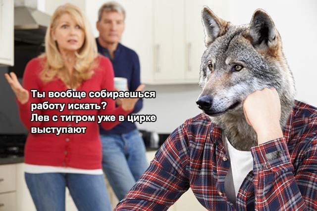
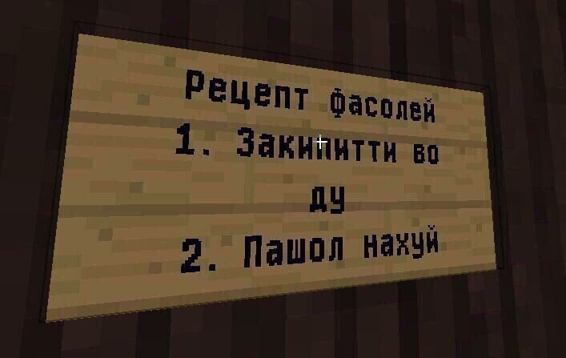

# Заголовок первого уровня

> Это цитата
>
> > Это цитата цитаты (2)
> >
> > > Это цитата цитаты (3)
> > >
> > > > Это цитата цитаты (4)
> > > >
> > > > > Это цитата цитаты (5)
> > > > >
> > > > > > Это цитата цитаты (6)

## Заголовок второго уровня

### Заголовок третьего уровня

#### Заголовок четвёртого уровня

##### Заголовок пятого уровня

###### Заголовок шестого уровня

---

тут пишу в строчку

тут\
пишу\
в\
столбик

# Проба текста по абзацам

Пишу долгий текст потому что свободного времени у меня завались, я потому что целеустремлённый молодой человек...

И следующий абзац начинается с того, что я делаю глоток ежевичного сока фирмы NAR, потому что я никогда в жизни его не пил, ощущение чего-то нового...

И последний абзац я хотел бы посвятить тому, что я вот пью впервые в жизни такой сок и впервые в жизни изучаю IT, и эти два абсолютно новых фактора, как говорит мой американский друг "blow your mind"... да лан, я это придумал)

Он так не говорит...

---

## Проба упорядоченного списка

1. Первое
2. Второе
3. cumпот

---

## Проба неупорядоченного списка

- Eel
- Eagle
- Illegal

### Проба цитат в списках

1. Ща будет цитата в списке
   > Хоба!
2. Тут пишу чё-то серьёзное, сидя с ноутбуком в коворкинге попивая смузи
3. Тут тоже
   > А тут хоба и снова цитата в списке, нечеловечески, понимаю...

А тут ща смешанный список будет:

1. Расрасрас

- Расрасрас

2. Двасдвасдвас

- Двасдвасдвас

3. Тристристрис

- Тристристрис

<professional progarammers code>

#### Проба разделения текста с использованием синтаксиса Markdown

Первая часть

---

Вторая часть

или

Первая часть

---

Вторая часть

# Гиперссылки (В Сибирь)

Вариант первый, встроенная ссылка с title элементом:

[Анекдот](https://pikabu.ru/story/skazka_o_zolotoy_ryibke_2781424/ "Внимание, анекдот!")
и картиночка - [тык](https://sun9-44.userapi.com/impg/xB-3-uqoJgoozurB-Xo872qxZlv-dJRYH-hDBQ/PdcAEtNUsFo.jpg?size=1080x770&quality=95&sign=6d35547e5bb5fe6500b1a509a1b8a63d&type=album/ "современные работы би лайк")

Вариант второй, без title элемента:

[без title](http://example.com/)

Третий вариант, с выносом url-ов, со сносками ниже:

Даный [пример][1] [служит][2] с [целью][id] обучения

[1]: http://example.com/ "Моё первое слово"
[2]: http://example.com/some
[id]: http://example.com/links "Моё второе слово"

_пример текста с HTML-тэгом em_

**пример текста с HTML-тэгом strong**

Пример: Ситуация из жизни, иду я _косой_ домой, а на встречу мне **полужирный** человек, а если бы он тоже был _косой_, то был бы **_полужирный и косой_**

# 23 года, а он всё картинками балуется

С подсказкой

Без подсказки

)

Со ссылкой

# Щуть-щуть по автоматическим ссылкам

<http://example.com/>
и
<mishwit@inbox.ru>

# Видео в статье

### Таблицы

| Первый столб | Второй столб |
| ------------ | ------------ |
| Содержимое 1 | Содержимое 3 |
| Содержимое 2 | Содержимое 4 |
